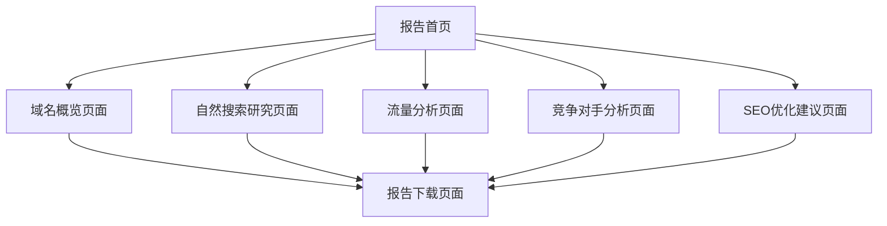

# Wephone SEMrush 分析可视化报告平台 - 产品需求文档

## 1. 产品概览

本产品是一个专为wephone设计的SEMrush数据分析可视化报告平台，旨在将复杂的SEO数据以简单易懂的方式展示给非技术背景的客户。
平台将SEMrush的原始数据转化为直观的图表和报告，帮助客户快速理解网站的SEO表现和优化机会。
目标是成为客户了解网站SEO状况的首选工具，提升客户对SEO服务价值的认知。

## 2. 核心功能

### 2.1 用户角色

| 角色 | 访问方式 | 核心权限 |
|------|----------|----------|
| 客户用户 | 直接访问链接 | 查看完整SEO分析报告，下载报告PDF |
| 管理员 | 后台登录 | 上传数据，编辑报告内容，管理用户访问 |

### 2.2 功能模块

我们的SEO分析报告平台包含以下主要页面：
1. **首页**：报告概览、核心指标卡片、导航菜单
2. **域名概览页面**：权威分数展示、反向链接分析、域名健康度评估
3. **自然搜索研究页面**：关键词排名分析、搜索流量趋势、关键词机会发现
4. **流量分析页面**：访问量趋势图、流量来源分析、用户行为数据
5. **竞争对手分析页面**：竞品对比、市场份额分析、差距识别
6. **SEO优化建议页面**：具体优化方案、优先级排序、实施指南
7. **报告下载页面**：PDF报告生成、数据导出功能

### 2.3 页面详情

| 页面名称 | 模块名称 | 功能描述 |
|----------|----------|----------|
| 首页 | 核心指标卡片 | 展示权威分数(599)、自然搜索关键词(682)、自然搜索流量(US$572.0)、反向链接(429)、引用域(253)等关键数据 |
| 首页 | 趋势概览图 | 显示近期SEO表现趋势，包含流量变化和排名波动 |
| 首页 | 快速导航 | 提供到各个详细分析页面的快速入口 |
| 域名概览页面 | 权威分数分析 | 详细展示域名权威分数599的构成和行业对比 |
| 域名概览页面 | 反向链接分析 | 展示429个反向链接的质量分布、来源分析、增长趋势 |
| 域名概览页面 | 引用域分析 | 分析253个引用域的权威性、相关性、地理分布 |
| 自然搜索研究页面 | 关键词排名表 | 展示682个关键词的排名位置、搜索量、流量价值 |
| 自然搜索研究页面 | 流量价值分析 | 详细分析US$572.0的流量价值构成和增长潜力 |
| 自然搜索研究页面 | 关键词趋势图 | 显示关键词排名变化趋势和季节性波动 |
| 流量分析页面 | 访问量趋势 | 展示4409次访问的时间分布和增长趋势 |
| 流量分析页面 | 流量来源分析 | 分析887个独立访客的来源渠道分布 |
| 流量分析页面 | 用户行为数据 | 展示跳出率49.80%、页面停留时间等用户体验指标 |
| 竞争对手分析页面 | 竞品对比表 | 对比主要竞争对手的SEO指标和市场表现 |
| 竞争对手分析页面 | 市场份额图 | 可视化展示在目标市场中的相对位置 |
| SEO优化建议页面 | 优化方案列表 | 基于数据分析提供具体的SEO优化建议 |
| SEO优化建议页面 | 优先级矩阵 | 按影响程度和实施难度对优化建议进行排序 |
| 报告下载页面 | PDF生成器 | 将所有分析数据整合成专业的PDF报告 |
| 报告下载页面 | 数据导出 | 提供Excel格式的原始数据下载 |

## 3. 核心流程

**客户访问流程：**
客户通过分享链接直接访问报告首页 → 查看核心指标概览 → 点击感兴趣的模块进入详细分析 → 浏览各项SEO数据和图表 → 查看优化建议 → 下载完整报告

**管理员操作流程：**
管理员登录后台 → 上传最新SEMrush数据 → 更新报告内容和分析 → 生成客户访问链接 → 发送给客户

## 4. 用户界面设计

### 4.1 设计风格

- **主色调**：专业蓝色 (#2563EB) 和清新绿色 (#10B981)
- **辅助色**：警告橙色 (#F59E0B) 和中性灰色 (#6B7280)
- **按钮风格**：圆角设计，渐变效果，悬停动画
- **字体**：中文使用思源黑体，英文使用Inter，标题18-24px，正文14-16px
- **布局风格**：卡片式设计，左侧导航，响应式网格布局
- **图标风格**：线性图标，统一的SEO主题图标集

### 4.2 页面设计概览

| 页面名称 | 模块名称 | UI元素 |
|----------|----------|---------|
| 首页 | 核心指标卡片 | 大数字展示，彩色进度条，趋势箭头图标，卡片阴影效果 |
| 首页 | 趋势概览图 | 折线图，蓝色渐变填充，交互式数据点，时间轴选择器 |
| 域名概览页面 | 权威分数展示 | 圆形进度图，分数动画效果，行业平均对比条 |
| 自然搜索研究页面 | 关键词排名表 | 可排序表格，排名变化箭头，搜索量柱状图，分页控件 |
| 流量分析页面 | 流量来源图 | 饼图和桑基图，颜色编码，悬停提示，图例说明 |
| 竞争对手分析页面 | 竞品对比 | 雷达图，对比表格，优势劣势标识，市场位置气泡图 |
| SEO优化建议页面 | 建议列表 | 优先级标签，实施难度星级，预期效果进度条 |

### 4.3 响应式设计

桌面优先设计，完全适配移动端和平板设备，支持触摸操作优化，确保在小屏幕上数据图表依然清晰可读。