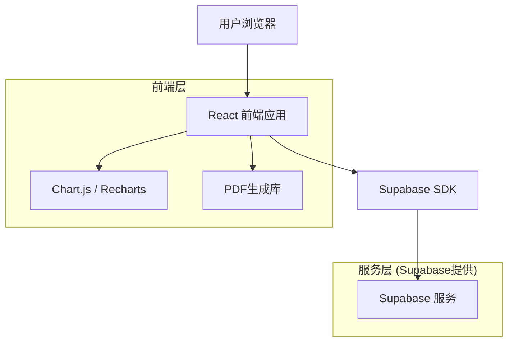
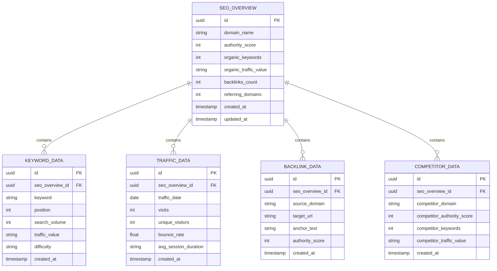

# Wephone SEMrush 分析可视化报告平台 - 技术架构文档

## 1. 架构设计



## 2. 技术描述

- 前端：React@18 + TypeScript + Tailwind CSS@3 + Vite
- 图表库：Recharts + Chart.js
- 数据存储：Supabase (PostgreSQL)
- 认证：Supabase Auth
- PDF生成：jsPDF + html2canvas
- 部署：Vercel

## 3. 路由定义

| 路由 | 用途 |
|------|-----|
| / | 报告首页，展示核心SEO指标概览和导航 |
| /domain-overview | 域名概览页面，展示权威分数、反向链接等数据 |
| /organic-research | 自然搜索研究页面，展示关键词排名和流量分析 |
| /traffic-analytics | 流量分析页面，展示访问量趋势和用户行为数据 |
| /competitor-analysis | 竞争对手分析页面，对比竞品SEO表现 |
| /seo-recommendations | SEO优化建议页面，提供具体优化方案 |
| /report-download | 报告下载页面，生成PDF和数据导出 |
| /admin | 管理员后台，数据管理和报告配置 |

## 4. API定义

### 4.1 核心API

SEO数据获取相关
```
GET /api/seo-data/overview
```

Response:
| 参数名称 | 参数类型 | 描述 |
|----------|----------|------|
| authorityScore | number | 域名权威分数 |
| organicKeywords | number | 自然搜索关键词数量 |
| organicTraffic | string | 自然搜索流量价值 |
| backlinks | number | 反向链接数量 |
| referringDomains | number | 引用域数量 |

示例
```json
{
  "authorityScore": 599,
  "organicKeywords": 682,
  "organicTraffic": "US$572.0",
  "backlinks": 429,
  "referringDomains": 253
}
```

关键词数据获取
```
GET /api/seo-data/keywords
```

Response:
| 参数名称 | 参数类型 | 描述 |
|----------|----------|------|
| keywords | array | 关键词列表 |
| keyword | string | 关键词文本 |
| position | number | 排名位置 |
| searchVolume | number | 月搜索量 |
| trafficValue | string | 流量价值 |

流量分析数据
```
GET /api/seo-data/traffic
```

Response:
| 参数名称 | 参数类型 | 描述 |
|----------|----------|------|
| totalVisits | number | 总访问量 |
| uniqueVisitors | number | 独立访客数 |
| bounceRate | string | 跳出率 |
| avgSessionDuration | string | 平均会话时长 |

## 5. 数据模型

### 5.1 数据模型定义



### 5.2 数据定义语言

SEO概览表 (seo_overview)
```sql
-- 创建表
CREATE TABLE seo_overview (
    id UUID PRIMARY KEY DEFAULT gen_random_uuid(),
    domain_name VARCHAR(255) NOT NULL,
    authority_score INTEGER NOT NULL,
    organic_keywords INTEGER NOT NULL,
    organic_traffic_value VARCHAR(50) NOT NULL,
    backlinks_count INTEGER NOT NULL,
    referring_domains INTEGER NOT NULL,
    created_at TIMESTAMP WITH TIME ZONE DEFAULT NOW(),
    updated_at TIMESTAMP WITH TIME ZONE DEFAULT NOW()
);

-- 创建索引
CREATE INDEX idx_seo_overview_domain ON seo_overview(domain_name);
CREATE INDEX idx_seo_overview_created_at ON seo_overview(created_at DESC);

-- 权限设置
GRANT SELECT ON seo_overview TO anon;
GRANT ALL PRIVILEGES ON seo_overview TO authenticated;

-- 初始数据
INSERT INTO seo_overview (domain_name, authority_score, organic_keywords, organic_traffic_value, backlinks_count, referring_domains)
VALUES ('wephoneshop.com', 599, 682, 'US$572.0', 429, 253);
```

关键词数据表 (keyword_data)
```sql
-- 创建表
CREATE TABLE keyword_data (
    id UUID PRIMARY KEY DEFAULT gen_random_uuid(),
    seo_overview_id UUID REFERENCES seo_overview(id) ON DELETE CASCADE,
    keyword VARCHAR(255) NOT NULL,
    position INTEGER NOT NULL,
    search_volume INTEGER NOT NULL,
    traffic_value VARCHAR(50),
    difficulty VARCHAR(20),
    created_at TIMESTAMP WITH TIME ZONE DEFAULT NOW()
);

-- 创建索引
CREATE INDEX idx_keyword_data_seo_overview_id ON keyword_data(seo_overview_id);
CREATE INDEX idx_keyword_data_position ON keyword_data(position);
CREATE INDEX idx_keyword_data_search_volume ON keyword_data(search_volume DESC);

-- 权限设置
GRANT SELECT ON keyword_data TO anon;
GRANT ALL PRIVILEGES ON keyword_data TO authenticated;
```

流量数据表 (traffic_data)
```sql
-- 创建表
CREATE TABLE traffic_data (
    id UUID PRIMARY KEY DEFAULT gen_random_uuid(),
    seo_overview_id UUID REFERENCES seo_overview(id) ON DELETE CASCADE,
    traffic_date DATE NOT NULL,
    visits INTEGER NOT NULL,
    unique_visitors INTEGER NOT NULL,
    bounce_rate DECIMAL(5,2) NOT NULL,
    avg_session_duration VARCHAR(20),
    created_at TIMESTAMP WITH TIME ZONE DEFAULT NOW()
);

-- 创建索引
CREATE INDEX idx_traffic_data_seo_overview_id ON traffic_data(seo_overview_id);
CREATE INDEX idx_traffic_data_date ON traffic_data(traffic_date DESC);

-- 权限设置
GRANT SELECT ON traffic_data TO anon;
GRANT ALL PRIVILEGES ON traffic_data TO authenticated;

-- 初始数据
INSERT INTO traffic_data (seo_overview_id, traffic_date, visits, unique_visitors, bounce_rate, avg_session_duration)
SELECT id, CURRENT_DATE, 4409, 887, 49.80, '07:21' FROM seo_overview WHERE domain_name = 'wephoneshop.com';
```

反向链接数据表 (backlink_data)
```sql
-- 创建表
CREATE TABLE backlink_data (
    id UUID PRIMARY KEY DEFAULT gen_random_uuid(),
    seo_overview_id UUID REFERENCES seo_overview(id) ON DELETE CASCADE,
    source_domain VARCHAR(255) NOT NULL,
    target_url TEXT NOT NULL,
    anchor_text TEXT,
    authority_score INTEGER,
    created_at TIMESTAMP WITH TIME ZONE DEFAULT NOW()
);

-- 创建索引
CREATE INDEX idx_backlink_data_seo_overview_id ON backlink_data(seo_overview_id);
CREATE INDEX idx_backlink_data_authority_score ON backlink_data(authority_score DESC);

-- 权限设置
GRANT SELECT ON backlink_data TO anon;
GRANT ALL PRIVILEGES ON backlink_data TO authenticated;
```

竞争对手数据表 (competitor_data)
```sql
-- 创建表
CREATE TABLE competitor_data (
    id UUID PRIMARY KEY DEFAULT gen_random_uuid(),
    seo_overview_id UUID REFERENCES seo_overview(id) ON DELETE CASCADE,
    competitor_domain VARCHAR(255) NOT NULL,
    competitor_authority_score INTEGER,
    competitor_keywords INTEGER,
    competitor_traffic_value VARCHAR(50),
    created_at TIMESTAMP WITH TIME ZONE DEFAULT NOW()
);

-- 创建索引
CREATE INDEX idx_competitor_data_seo_overview_id ON competitor_data(seo_overview_id);
CREATE INDEX idx_competitor_data_authority_score ON competitor_data(competitor_authority_score DESC);

-- 权限设置
GRANT SELECT ON competitor_data TO anon;
GRANT ALL PRIVILEGES ON competitor_data TO authenticated;
```